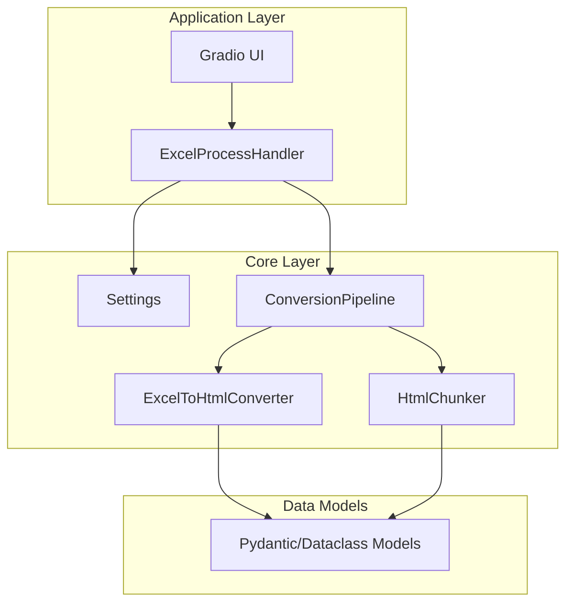

# Design Document: Code Style Refactor

## Overview

本设计文档描述了根据 CONTRIBUTE.md 规范对项目代码进行重构的技术方案。重构将采用渐进式方法，按模块逐步改造，确保每个阶段都能独立验证和测试。

## Architecture

### 重构后的项目结构

```
src/
├── app/
│   ├── __init__.py          # 应用入口，loguru 配置
│   ├── main.py               # 应用启动
│   ├── ui.py                 # Gradio UI 组件
│   ├── handlers.py           # 业务处理器（重构为类）
│   └── styles.py             # CSS 样式常量
├── core/
│   ├── __init__.py
│   ├── config.py             # 新增：pydantic-settings 配置
│   ├── models.py             # 新增：数据模型定义
│   └── excel2html/
│       ├── __init__.py
│       ├── converter.py      # 重构：Excel转HTML转换器类
│       ├── chunker.py        # 重构：HTML切分器类
│       ├── pipeline.py       # 重构：流水线类
│       └── utils.py          # 工具函数
└── tests/
    ├── conftest.py           # pytest fixtures
    ├── test_converter.py     # 转换器测试
    ├── test_chunker.py       # 切分器测试
    └── test_models.py        # 数据模型测试
```

### 架构设计原则



## Components and Interfaces

### 1. 配置管理组件 (Config_Manager)

```python
# src/core/config.py
from pydantic_settings import BaseSettings
from pydantic import Field

class Settings(BaseSettings):
    """应用配置"""
    temp_dir: Path = Field(default=Path("./temp"))
    default_max_tokens: int = Field(default=1024)
    default_max_rows: int = Field(default=8)
    log_level: str = Field(default="INFO")
    
    model_config = {"env_prefix": "EXCEL2HTML_"}
```

### 2. 数据模型组件 (Models)

```python
# src/core/models.py
from dataclasses import dataclass, field
from pathlib import Path
from enum import StrEnum

class SplitMode(StrEnum):
    """切分模式枚举"""
    BY_TOKENS = "按 Token 数"
    BY_ROWS = "按行数"

class TokenStrategy(StrEnum):
    """Token 切分策略"""
    PREFER_MAX = "prefer_max"
    PREFER_MIN = "prefer_min"

@dataclass
class ChunkConfig:
    """切分配置"""
    split_mode: SplitMode
    max_tokens: int | None = None
    min_tokens: int | None = None
    max_rows: int | None = None
    token_strategy: TokenStrategy = TokenStrategy.PREFER_MAX
    separator: str = "!!!_CHUNK_BREAK_!!!"

@dataclass
class ChunkResult:
    """切分结果"""
    chunks: list[str]
    warnings: list[dict]
    stats: dict

@dataclass
class ConversionResult:
    """转换结果"""
    html_path: Path
    chunk_path: Path
    chunk_count: int
    status_message: str
```

### 3. Excel转换器组件 (Converter)

```python
# src/core/excel2html/converter.py
from dataclasses import dataclass
from pathlib import Path
from loguru import logger

@dataclass
class ExcelToHtmlConverter:
    """Excel 转 HTML 转换器"""
    keywords: list[str] | None = None
    
    def convert(self, excel_path: Path) -> Path | None:
        """执行转换"""
        ...
    
    def _extract_merged_cells(self, sheet) -> dict:
        """提取合并单元格信息"""
        ...
    
    def _build_flattened_headers(self, sheet, merged_info: dict, header_rows: int) -> dict:
        """构建扁平化表头"""
        ...
```

### 4. HTML切分器组件 (Chunker)

```python
# src/core/excel2html/chunker.py
from dataclasses import dataclass
from loguru import logger

@dataclass
class HtmlChunker:
    """HTML 切分器"""
    config: ChunkConfig
    
    def chunk(self, html_content: str) -> ChunkResult:
        """执行切分"""
        ...
    
    def _calculate_tokens(self, text: str) -> int:
        """计算 token 数"""
        ...
    
    def _build_chunk(self, rows: list, context: dict) -> str:
        """构建单个 chunk"""
        ...
```

### 5. 业务处理器组件 (Handler)

```python
# src/app/handlers.py
from dataclasses import dataclass, field
from pathlib import Path
from loguru import logger

@dataclass
class ProcessingState:
    """处理状态（替代全局变量）"""
    html_path: Path | None = None
    chunk_path: Path | None = None

@dataclass
class ExcelProcessHandler:
    """Excel 处理器"""
    state: ProcessingState = field(default_factory=ProcessingState)
    
    def process(self, excel_file, config: ChunkConfig, keywords: list[str] | None) -> tuple[Path | None, Path | None, str]:
        """处理 Excel 文件"""
        ...
    
    def get_html_preview(self) -> str | None:
        """获取 HTML 预览"""
        ...
    
    def get_chunk_preview(self) -> str | None:
        """获取 Chunk 预览"""
        ...
```

## Data Models

### 输入数据模型

```python
from pydantic import BaseModel, Field, field_validator

class ProcessRequest(BaseModel):
    """处理请求（外部输入验证）"""
    keywords: list[str] = Field(default_factory=list)
    split_mode: str
    max_rows: int = Field(ge=1, le=100)
    target_tokens: int = Field(ge=64, le=8192)
    min_tokens: int | None = Field(default=None, ge=64)
    separator: str = Field(default="!!!_CHUNK_BREAK_!!!")
    
    @field_validator("keywords", mode="before")
    @classmethod
    def parse_keywords(cls, v: str | list) -> list[str]:
        if isinstance(v, str):
            return [k.strip() for k in v.split(",") if k.strip()]
        return v
```

### 内部数据模型

```python
@dataclass
class MergedCellInfo:
    """合并单元格信息"""
    value: str | None
    rowspan: int
    colspan: int
    is_origin: bool
    skip: bool

@dataclass
class TableNote:
    """表格注释"""
    key: str
    content: str
    is_header_note: bool = False

@dataclass
class ChunkStats:
    """切分统计"""
    total_chunks: int
    oversized_chunks: int
    token_counts: list[int]
    max_token_count: int
    min_token_count: int
    avg_token_count: float
```

## Correctness Properties

*A property is a characteristic or behavior that should hold true across all valid executions of a system-essentially, a formal statement about what the system should do. Properties serve as the bridge between human-readable specifications and machine-verifiable correctness guarantees.*

### Property 1: Path Operations Use Pathlib

*For any* source file in the project, all path operations SHALL use `pathlib.Path` and no `os.path` module functions SHALL be present.

**Validates: Requirements 1.1, 1.2, 1.5, 1.6**

### Property 2: Logging Uses Loguru

*For any* source file in the project (excluding tests), all logging operations SHALL use `loguru.logger` and no `print()` statements or `logging` module imports SHALL be present.

**Validates: Requirements 2.1, 2.2, 2.3**

### Property 3: Modern Type Syntax

*For any* source file in the project, no `typing.List`, `typing.Dict`, `typing.Union`, or `typing.Optional` imports SHALL be present, and all type hints SHALL use Python 3.12 native syntax.

**Validates: Requirements 4.1, 4.2, 4.3**

### Property 4: Complete Type Hints

*For any* public function or method in the project, all parameters and return values SHALL have type hints.

**Validates: Requirements 4.5**

### Property 5: F-String Formatting

*For any* source file in the project, no `%` string formatting or `.format()` method calls SHALL be present for string interpolation.

**Validates: Requirements 5.1, 5.2**

### Property 6: No Global Mutable State

*For any* source file in the project, no module-level mutable variables (lists, dicts, or reassignable variables) SHALL be present outside of class definitions.

**Validates: Requirements 10.1**

### Property 7: Method Length Limit

*For any* method or function in the project, the line count SHALL NOT exceed 50 lines.

**Validates: Requirements 3.3**

### Property 8: Dataclass for Data Objects

*For any* class that is purely a data container (no business logic methods), it SHALL be decorated with `@dataclass`.

**Validates: Requirements 3.2, 7.2**

### Property 9: Enum for Constants

*For any* string constant used in multiple places (magic strings), it SHALL be defined as an `Enum` or `StrEnum` member.

**Validates: Requirements 5.4**

### Property 10: Centralized Config

*For any* source file in the project (excluding config module), no `os.getenv` calls SHALL be present.

**Validates: Requirements 6.2**

## Error Handling

### 错误处理策略

1. **文件操作错误**
   - 使用 `try/except` 捕获 `IOError`、`FileNotFoundError`
   - 通过 `logger.error()` 记录详细错误信息
   - 返回明确的错误状态给调用者

2. **数据验证错误**
   - 使用 Pydantic 验证外部输入
   - 捕获 `ValidationError` 并转换为用户友好的错误消息

3. **转换处理错误**
   - 使用 `Result` 模式返回成功/失败状态
   - 保留原始异常信息用于调试

```python
from dataclasses import dataclass
from typing import TypeVar, Generic

T = TypeVar("T")

@dataclass
class Result(Generic[T]):
    """操作结果封装"""
    success: bool
    value: T | None = None
    error: str | None = None
    
    @classmethod
    def ok(cls, value: T) -> "Result[T]":
        return cls(success=True, value=value)
    
    @classmethod
    def fail(cls, error: str) -> "Result[T]":
        return cls(success=False, error=error)
```

## Testing Strategy

### 测试框架配置

- **主框架**: pytest
- **属性测试**: hypothesis
- **异步测试**: pytest-asyncio
- **覆盖率**: pytest-cov

### 测试类型

1. **单元测试**
   - 测试各组件的独立功能
   - 使用 fixtures 提供测试数据
   - 覆盖边界条件和错误情况

2. **属性测试**
   - 验证代码风格属性（使用 AST 分析）
   - 验证数据转换的不变性
   - 最少 100 次迭代

3. **集成测试**
   - 测试完整的转换流水线
   - 验证组件间的交互

### pytest 配置

```toml
# pyproject.toml
[tool.pytest.ini_options]
testpaths = ["tests"]
python_files = ["test_*.py"]
python_functions = ["test_*"]
addopts = "-v --tb=short"

[tool.hypothesis]
max_examples = 100
```

### 属性测试示例

```python
# tests/test_code_style.py
import ast
from pathlib import Path
from hypothesis import given, strategies as st

def get_source_files() -> list[Path]:
    """获取所有源文件"""
    return list(Path("src").rglob("*.py"))

@given(st.sampled_from(get_source_files()))
def test_no_os_path_usage(source_file: Path):
    """
    Feature: code-style-refactor, Property 1: Path Operations Use Pathlib
    Validates: Requirements 1.1, 1.2, 1.5, 1.6
    """
    content = source_file.read_text()
    tree = ast.parse(content)
    
    for node in ast.walk(tree):
        if isinstance(node, ast.Import):
            for alias in node.names:
                assert not alias.name.startswith("os.path")
        elif isinstance(node, ast.ImportFrom):
            assert node.module != "os.path"
            if node.module == "os":
                for alias in node.names:
                    assert alias.name != "path"
```

### Ruff 配置

```toml
# pyproject.toml
[tool.ruff]
target-version = "py312"
line-length = 100

[tool.ruff.lint]
select = [
    "E",      # pycodestyle errors
    "W",      # pycodestyle warnings
    "F",      # Pyflakes
    "I",      # isort
    "B",      # flake8-bugbear
    "C4",     # flake8-comprehensions
    "UP",     # pyupgrade
    "ARG",    # flake8-unused-arguments
    "SIM",    # flake8-simplify
]
ignore = ["E501"]  # line too long (handled by formatter)

[tool.ruff.format]
quote-style = "double"
indent-style = "space"
```

### Pre-commit 配置

```yaml
# .pre-commit-config.yaml
repos:
  - repo: https://github.com/astral-sh/ruff-pre-commit
    rev: v0.4.0
    hooks:
      - id: ruff
        args: [--fix]
      - id: ruff-format
  
  - repo: local
    hooks:
      - id: uv-lock-check
        name: Check uv.lock
        entry: uv lock --check
        language: system
        pass_filenames: false
```
